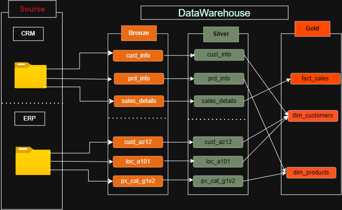
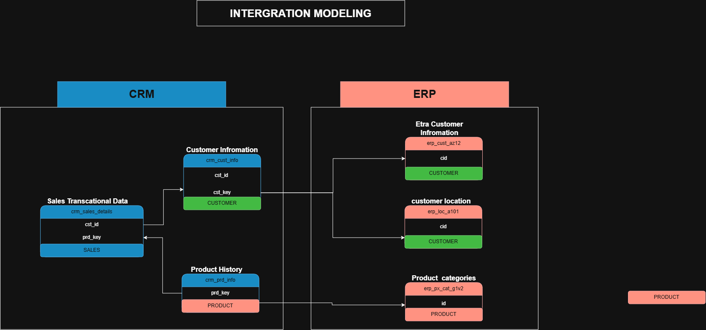
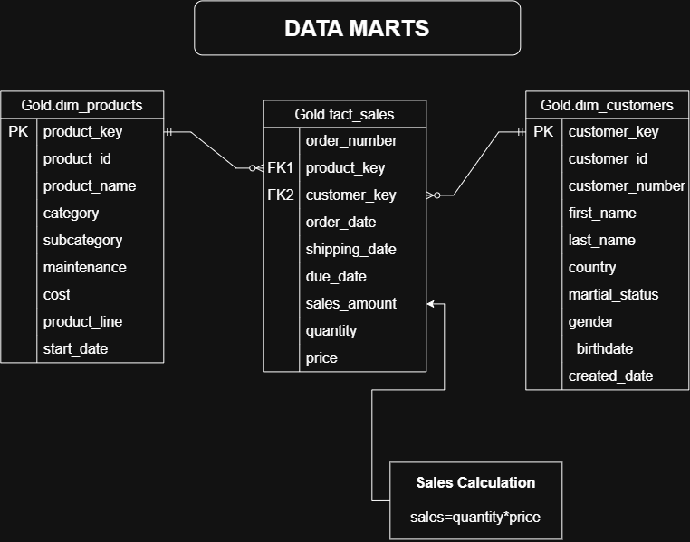

# SQL Data Warehouse Project

A modern **SQL Server Data Warehouse** built using the **Medallion Architecture (Bronze → Silver → Gold)** to integrate CRM and ERP data into a clean, validated, and analytics-ready data model.

This project demonstrates an end-to-end data warehousing workflow — from raw CSV ingestion and data quality validation to ETL transformations, dimensional modeling, and business-ready datasets for **BI, reporting, and analytics**.

---

## 📋 Table of Contents

* [Project Overview](#-project-overview)
* [Architecture](#-architecture)
* [Data Sources](#-data-sources)
* [Source Data Model](#-source-data-model)
* [ETL Pipeline](#-etl-pipeline)
* [Data Quality & Validation](#-data-quality--validation)
* [Gold Layer Data Model](#-gold-layer-data-model)
* [Project Structure](#-project-structure)
* [How to Run the Project](#-how-to-run-the-project)
* [Tech Stack](#-tech-stack)
* [Key Concepts Demonstrated](#-key-concepts-demonstrated)
* [Project Status](#-project-status)
* [Future Improvements](#-future-improvements)
* [Author](#-author)

---

## 📌 Project Overview

The goal of this project is to build a centralized data warehouse that integrates data from two source systems:

* **CRM** — Customer, product, and sales transaction data
* **ERP** — Customer demographic, location, and product category data

The data passes through three layers:

```text
CRM + ERP Source CSV Files
          ↓
    🥉 Bronze Layer
       Raw Data
          ↓
    🥈 Silver Layer
 Cleaned & Standardized Data
          ↓
     🥇 Gold Layer
 Business-Ready Star Schema
          ↓
   BI / Reporting / Analytics
```

The project focuses on building a reliable ETL pipeline, improving data quality, resolving cross-system key inconsistencies, and creating a dimensional model optimized for analytical workloads.

---

# 🏗️ Architecture

The project follows the **Medallion Architecture**, where each layer has a specific responsibility.

| Layer         | Purpose                         | Implementation                      |
| ------------- | ------------------------------- | ----------------------------------- |
| 🥉 **Bronze** | Raw source data                 | Tables + `BULK INSERT`              |
| 🥈 **Silver** | Cleaned and standardized data   | Stored Procedures + transformations |
| 🥇 **Gold**   | Business-ready analytical model | Views + Star Schema                 |

### Data Warehouse Architecture



---

# 📂 Data Sources

The project integrates six CSV files from two source systems.

### CRM System

| File                | Description                   |
| ------------------- | ----------------------------- |
| `cust_info.csv`     | Customer master information   |
| `prd_info.csv`      | Product master information    |
| `sales_details.csv` | Sales transaction information |

### ERP System

| File              | Description                                                |
| ----------------- | ---------------------------------------------------------- |
| `CUST_AZ12.csv`   | Customer demographic information                           |
| `LOC_A101.csv`    | Customer location information                              |
| `PX_CAT_G1V2.csv` | Product category, subcategory, and maintenance information |

---

# 🔗 Source Data Model

The source systems contain different key formats, so the Silver layer standardizes these keys before they are used in the Gold layer.

### Data Integration Model



### Key Relationships

#### Customer

```text
CRM: cst_key
      ↕
ERP: cid
```

The ERP customer ID contains a `NAS` prefix that is removed during the Silver-layer transformation so that it can match the CRM customer key.

#### Customer Location

```text
CRM: cst_key
      ↕
ERP: cid
```

ERP location IDs contain hyphens, which are removed during transformation to align with the CRM key format.

#### Product Category

```text
CRM: prd_key
      ↓
Derived cat_id
      ↓
ERP: PX_CAT_G1V2.id
```

The Silver layer derives `cat_id` from the CRM product key and uses it to connect products with ERP category information.

#### Sales

```text
Sales Transactions
       │
       ├──→ Customer Master
       │
       └──→ Product Master
```

Sales transactions connect to the CRM customer and product master data using customer IDs and product keys.

These transformations ensure that the cross-system relationships are consistent and reliable before the data reaches the Gold layer.

---

# ⚙️ ETL Pipeline

## 1. Database & Schema Setup

The project creates a `DataWarehouse` database with three schemas:

```sql
CREATE DATABASE DataWarehouse;

CREATE SCHEMA Bronze;
CREATE SCHEMA Silver;
CREATE SCHEMA Gold;
```

The database setup script is located at:

```text
scripts/create_databse.sql
```

---

# 🥉 Bronze Layer

The Bronze layer stores raw data from the CRM and ERP CSV files.

The tables closely mirror the original source structure.

### Bronze Tables

```text
Bronze.crm_cust_info
Bronze.crm_prd_info
Bronze.crm_sales_details

Bronze.erp_cust_az12
Bronze.erp_loc_a101
Bronze.erp_px_cat_g1v2
```

The Bronze DDL is located at:

```text
scripts/bronze/ddl_bronze.sql
```

### Bronze Loading

Run:

```sql
EXEC Bronze.load_bronze;
```

The Bronze load procedure:

* Truncates existing Bronze tables
* Loads CSV files using `BULK INSERT`
* Skips CSV headers
* Uses `TABLOCK` for bulk loading
* Tracks individual table load duration
* Tracks total batch duration
* Uses `TRY...CATCH` error handling
* Reports errors through `PRINT` statements

The loading procedure is located at:

```text
scripts/bronze/load_storage_procedure.sql
```

---

# 🥈 Silver Layer

The Silver layer transforms raw Bronze data into clean, standardized, and validated datasets.

### Customer Transformations

* Removes duplicate customer records
* Keeps the latest record using `ROW_NUMBER()`
* Trims text fields
* Standardizes gender values
* Standardizes marital status values

### Product Transformations

* Derives `cat_id`
* Standardizes product keys
* Handles missing product costs
* Standardizes product line values
* Calculates product end dates using `LEAD()`
* Converts product dates to appropriate date types

### Sales Transformations

* Validates order, shipping, and due dates
* Converts integer dates into SQL `DATE`
* Handles invalid dates
* Validates sales calculations
* Recalculates invalid sales values
* Handles zero, NULL, and inconsistent prices

```text
Sales Amount = Quantity × Price
```

### ERP Customer Transformations

* Removes the `NAS` prefix from customer IDs
* Validates birthdates
* Standardizes gender values

### ERP Location Transformations

* Removes hyphens from customer IDs
* Standardizes country names

Examples:

```text
DE  → Germany
USA → United States
US  → United States
UK  → United Kingdom
```

### Silver Load Procedure

Run:

```sql
EXEC Silver.load_silver;
```

The procedure includes:

* Table-level load timing
* Total batch timing
* `TRY...CATCH` error handling
* Error messages and error numbers

The Silver load procedure is located at:

```text
scripts/Silver/Silver_load_procedure,sql
```

---

# 🔍 Data Quality & Validation

Data quality checks are implemented across the Bronze, Silver, and Gold layers.

## Bronze Validation

The Bronze layer validation checks include:

* NULL values
* Duplicate business keys
* Unwanted whitespace
* Invalid categorical values
* Negative values
* NULL numeric values
* Invalid dates
* Date consistency
* Sales calculations
* Customer relationships
* Product relationships
* Birthdate validation
* Country values
* Gender values
* Marital status values
* Product category relationships

Located at:

```text
scripts/bronze/Bronze_Layer_DataCheck.sql
```

---

## Silver Validation

The Silver layer checks verify that the transformations were performed correctly.

Checks include:

* Business key uniqueness
* NULL values
* Unwanted whitespace
* Standardized categorical values
* Numeric validation
* Date validation
* Sales calculation validation
* Customer-product relationships
* ERP transformations
* Product-category relationships

Located at:

```text
scripts/Silver/Silver_layer_DataCheck.sql
```

---

## Gold Validation

The Gold layer contains additional checks to validate the final analytical model.

### Customer Join Validation

Checks whether joins between CRM customers, ERP demographics, and ERP locations create duplicate customer records.

### Source Attribute Validation

Compares CRM and ERP gender values to identify matching or conflicting values.

CRM is treated as the master source for customer gender.

### Product Join Validation

Checks whether product-category joins create duplicate active products.

### Fact-to-Dimension Validation

Checks whether sales transactions successfully connect to:

```text
Gold.dim_customers
Gold.dim_products
```

The Gold validation script is located at:

```text
scripts/Gold/gold_layer_data_check.sql
```

---

# ⭐ Gold Layer Data Model

The Gold layer implements a **Star Schema** designed for analytical queries, reporting, and BI tools.

### Gold Data Mart



---

## Dimension Tables

### `Gold.dim_customers`

Contains business-ready customer information.

Key attributes include:

* Customer key
* Customer ID
* Customer number
* First name
* Last name
* Country
* Marital status
* Gender
* Birthdate
* Create date

The customer dimension combines:

```text
CRM Customer Data
        +
ERP Customer Demographics
        +
ERP Customer Location
```

CRM is treated as the master source for customer attributes, while ERP demographic data is used to supplement missing gender information.

---

### `Gold.dim_products`

Contains current product information.

Key attributes include:

* Product key
* Product ID
* Product number
* Product name
* Category
* Subcategory
* Maintenance
* Cost
* Product line
* Start date

Only currently active products are included:

```sql
WHERE pr.prd_end_dt IS NULL
```

---

## Fact Table

### `Gold.fact_sales`

Contains sales transactions linked to the customer and product dimensions.

Key fields include:

* Order number
* Customer key
* Product key
* Order date
* Shipping date
* Due date
* Sales amount
* Quantity
* Price

The fact table connects to the dimensions through surrogate keys:

```text
              Gold.fact_sales
                    │
          ┌─────────┴─────────┐
          ↓                   ↓
Gold.dim_customers    Gold.dim_products
```

---

# 🗂️ Project Structure

```text
sql-data-warehouse-project/
│
├── datasets/
│   ├── source_crm/
│   │   ├── cust_info.csv
│   │   ├── prd_info.csv
│   │   └── sales_details.csv
│   │
│   └── source_erp/
│       ├── CUST_AZ12.csv
│       ├── LOC_A101.csv
│       └── PX_CAT_G1V2.csv
│
├── docs/
│   ├── DataWarehouse.png
│   ├── data_integration_model_overview.png
│   ├── data_mart.png
│   └── images/
│
├── scripts/
│   │
│   ├── create_databse.sql
│   │
│   ├── bronze/
│   │   ├── ddl_bronze.sql
│   │   ├── load_storage_procedure.sql
│   │   └── Bronze_Layer_DataCheck.sql
│   │
│   ├── Silver/
│   │   ├── Silver_ddl.sql
│   │   ├── Silver_load_procedure,sql
│   │   └── Silver_layer_DataCheck.sql
│   │
│   └── Gold/
│       ├── gold_layer.sql
│       └── gold_layer_data_check.sql
│
└── README.md
```

---

# 🚀 How to Run the Project

## Step 1 — Create Database and Schemas

Run:

```text
scripts/create_databse.sql
```

This creates:

```text
DataWarehouse
├── Bronze
├── Silver
└── Gold
```

---

## Step 2 — Create Bronze Tables

Run:

```text
scripts/bronze/ddl_bronze.sql
```

---

## Step 3 — Load Bronze Layer

Run:

```sql
EXEC Bronze.load_bronze;
```

> **Important:** The Bronze load procedure uses local Windows file paths for `BULK INSERT`. Update these paths to match the location of your CSV files before execution.

---

## Step 4 — Validate Bronze Layer

Run:

```text
scripts/bronze/Bronze_Layer_DataCheck.sql
```

Most validation queries are designed to return **no rows** when the data passes the corresponding check.

---

## Step 5 — Create Silver Tables

Run:

```text
scripts/Silver/Silver_ddl.sql
```

---

## Step 6 — Load Silver Layer

Run:

```sql
EXEC Silver.load_silver;
```

---

## Step 7 — Validate Silver Layer

Run:

```text
scripts/Silver/Silver_layer_DataCheck.sql
```

---

## Step 8 — Create Gold Views

Run:

```text
scripts/Gold/gold_layer.sql
```

This creates:

```text
Gold.dim_customers
Gold.dim_products
Gold.fact_sales
```

---

## Step 9 — Validate Gold Layer

Run:

```text
scripts/Gold/gold_layer_data_check.sql
```

This validates:

* Customer joins
* Product joins
* Dimension uniqueness
* Source attribute consistency
* Fact-to-dimension relationships

---

# 🛠️ Tech Stack

### Database

* Microsoft SQL Server

### Development Tool

* SQL Server Management Studio (SSMS)

### SQL & Data Engineering Techniques

* T-SQL
* DDL
* DML
* Views
* Stored Procedures
* CTEs
* Window Functions
* `ROW_NUMBER()`
* `LEAD()`
* `CASE`
* `COALESCE`
* `TRIM`
* `ISNULL`
* `NULLIF`
* `BULK INSERT`
* `TRY...CATCH`
* Data Validation
* Data Cleaning
* Data Transformation

### Data Architecture

* Medallion Architecture
* Star Schema
* Dimensional Modeling
* ETL Pipeline

---

# 🎯 Key Concepts Demonstrated

This project demonstrates practical experience with:

* Building a SQL Server data warehouse from scratch
* Designing Bronze, Silver, and Gold layers
* Loading CSV files into SQL Server
* Developing reusable ETL stored procedures
* Handling inconsistent source data
* Data cleansing and standardization
* Deduplication using window functions
* Cross-system key transformation
* Date validation and transformation
* Data quality testing
* Referential integrity validation
* Fact and dimension modeling
* Surrogate key generation
* Star schema design
* Business-ready data modeling
* Preparing data for BI and reporting

---

# 📊 Project Status

| Component                     | Status     |
| ----------------------------- | ---------- |
| Database & schema setup       | ✅ Complete |
| Bronze layer DDL              | ✅ Complete |
| Bronze loading procedure      | ✅ Complete |
| Bronze data quality checks    | ✅ Complete |
| Silver layer DDL              | ✅ Complete |
| Silver transformations        | ✅ Complete |
| Silver loading procedure      | ✅ Complete |
| Silver data quality checks    | ✅ Complete |
| Gold customer dimension       | ✅ Complete |
| Gold product dimension        | ✅ Complete |
| Gold sales fact               | ✅ Complete |
| Gold data quality checks      | ✅ Complete |
| Data warehouse architecture   | ✅ Complete |
| Source data integration model | ✅ Complete |
| Gold data mart model          | ✅ Complete |
| Documentation                 | ✅ Complete |

---

# 🔮 Future Improvements

Potential next steps include:

* Build a Power BI dashboard using the Gold layer
* Add automated data-quality reporting
* Add ETL audit/log tables
* Replace `PRINT`-based logging with persistent logging tables
* Make `BULK INSERT` paths configurable
* Implement incremental loading
* Implement Slowly Changing Dimensions (SCD)
* Add indexes and query-performance optimization
* Add automated ETL testing
* Add business-focused analytical SQL queries

---

# 👨‍💻 Author

## Muhammad Jamal

**Data Science Graduate | Data Analytics | SQL | Power BI | Data Engineering**

* 🔗 **LinkedIn:** [Muhammad Jamal](https://www.linkedin.com/in/muhammad-jamal-a08241240)
* 💻 **GitHub:** [muhammadjamal1155](https://github.com/muhammadjamal1155)

---

# ⭐ Project Purpose

This project was developed as a hands-on implementation of modern **data warehousing and data engineering concepts**, covering the complete journey from raw source data to analytics-ready business data.

It demonstrates how data from multiple operational systems can be:

**Ingested → Cleaned → Standardized → Validated → Transformed → Modeled**

into a centralized SQL Server Data Warehouse that supports reliable **reporting, analytics, and business intelligence**.

If you find the project useful, feel free to explore the repository, fork it, and provide feedback.
